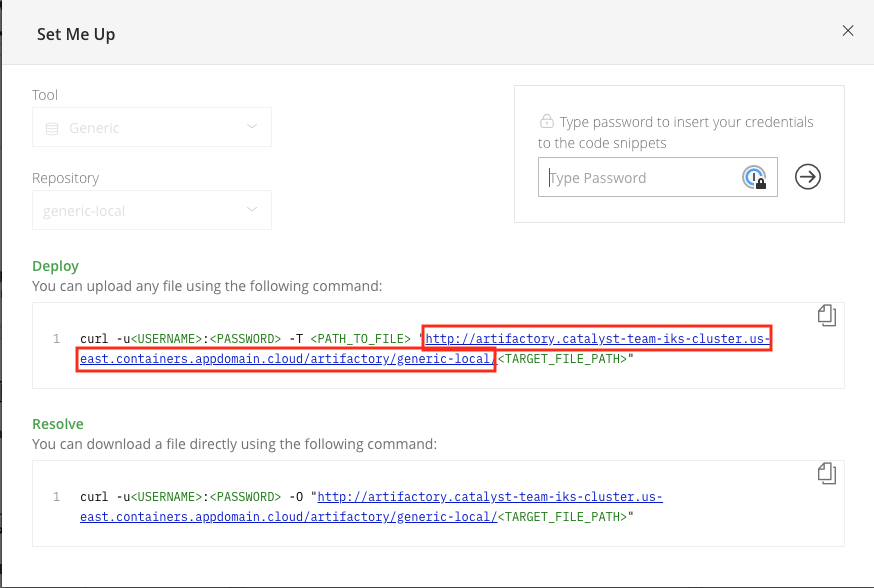

# Argo CD Configuration

To enable Argo CD to work seamlessly with the [Iteration Zero Tools](https://github.ibm.com/garage-catalyst/iteration-zero-ibmcloud) installation you need to configure Artifactory to be used as a Helm Chart Repository. This will enable the use of Helm charts that are included in the applications to be de-coupled from the image that is build with the CI pipeline with Jenkins. There is an sample in this repository that directly references the image from the IBM Cloud Image Registry if you do not want to use helm charts from a registery.

### Update Config Map for Argo CD

In the `config` directory there is a `yaml` file called `argocd-helm-repo.yaml`. Edit this file and modify the `- url:` to point to the URL of the Artificatory Repository. 

```
apiVersion: v1
kind: ConfigMap
metadata:
  name: argocd-cm
  namespace: tools
data:
  helm.repositories: |
    - url: http://artifactory.catalyst-team-iks-cluster.us-east.containers.appdomain.cloud/artifactory/generic-local/catalyst-team/
      name: catalyst-team
```

If you have configured the Artifactory instance to store Helm charts from your CI pipeline with Jenkins. You can easily get this value by Logging into Artifactory and clicking on `Setup Me Up` tile and click on the repository `generic-local` 


This will open the detailed setup view and from here you can copy the URL from the setup screen.



### Run the Kubectl Command

Now you have edited the yamp you need to make sure you logged into the Command Line with either IBM Kubernetes Service or Red Hat OpenShift instructions. 

You can test this by running the following commands :

```bash 
kubectl get nodes | oc get nodes
```

There is a helper shell script that you can run call `updateArgo.sh` this runs the following command to add the details of the Helm Registry with ArgoCD Config map.

```
#!/bin/bash
kubectl apply -f argocd-helm-repo.yaml
```

Once this is complete you can validate the configuration by opening the Config Map in the IKS Console or OpenShift Cluster Console. Navigate to the `tools` namespace and view the `Config Maps` open up the config map called `argocd-cm` and validate the the `Data` section now has a `helm.repositorys` entry that is referencing Artifactory.  

